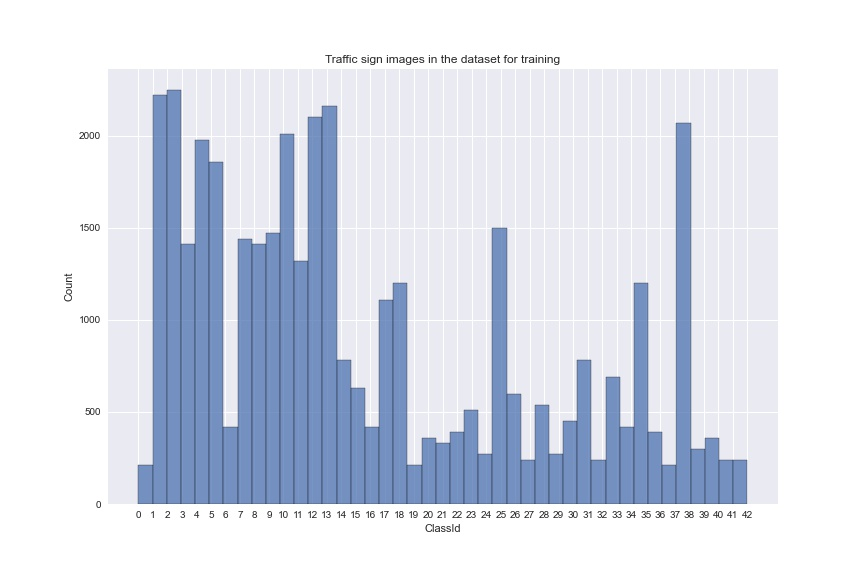
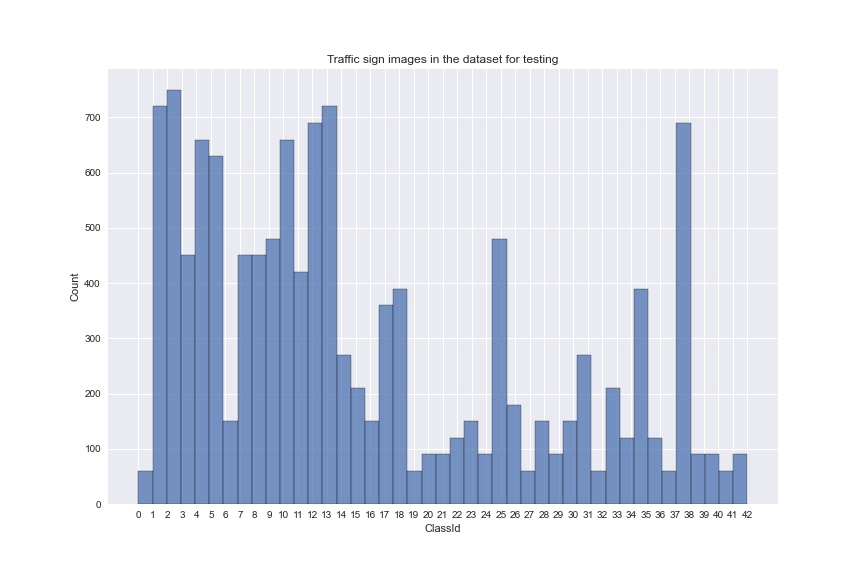
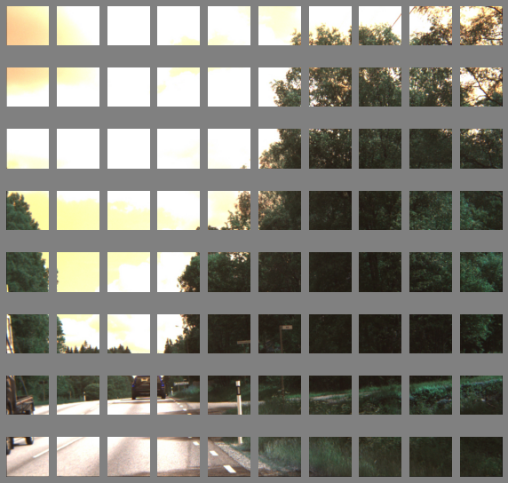
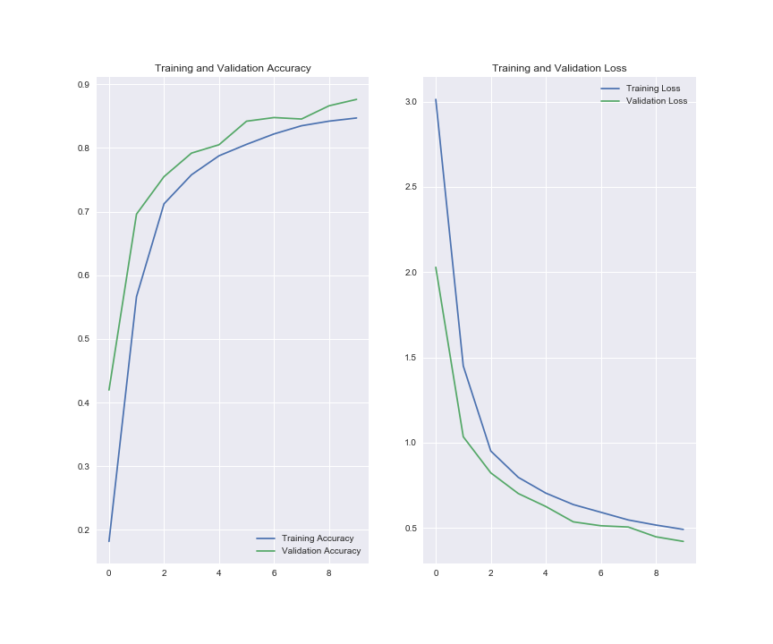
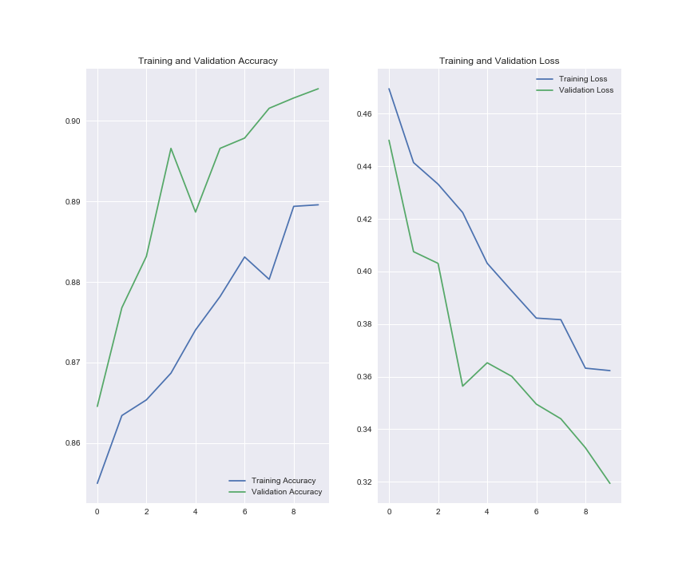
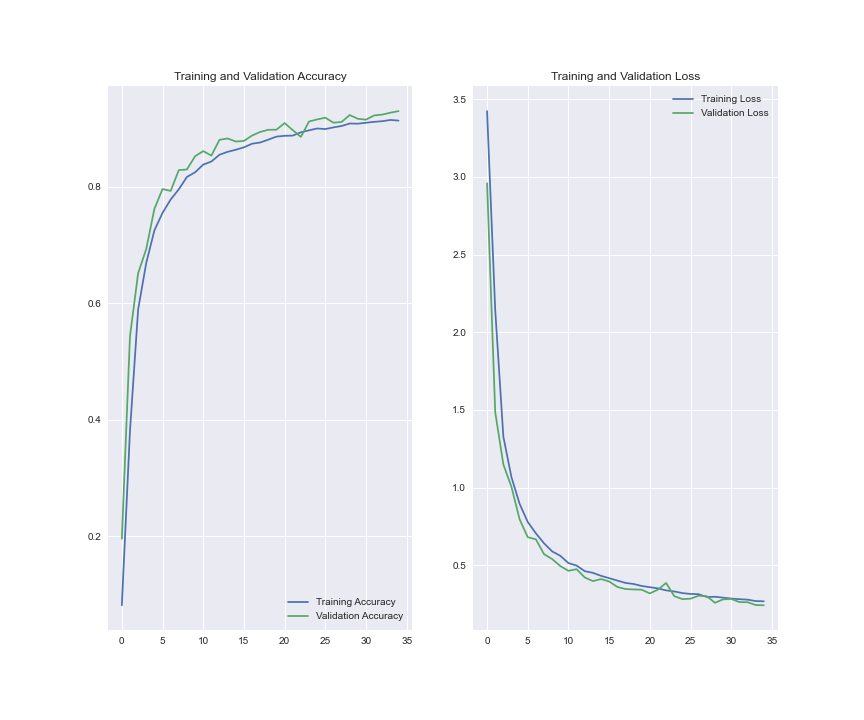
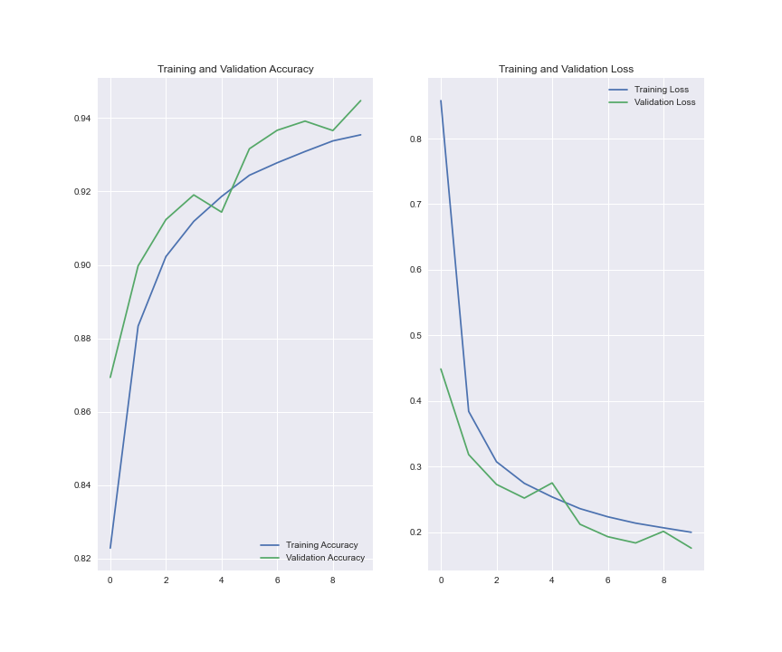

# Traffic Sign Recognition, using CNN and TensorFlow
## Overview
This work is the final project of the DataBootcamp at IronHack in Madrid, Spain. Basically, the present project consists in image recognition of traffic signs using Convolutional Neural Networks (CNN) as a exploratory study over deep learning applycations. Readers should have in mind the topic has been choosen by the author, and the project needed to be developed in one week.


## Description
As previously it was said, the fundamental of this work is to explore and learn about deep learning and neural network applications. Note it could be infered that the author has chosen this topic as a basic and very first approach to understand computer vision in areas such as robotic and self-driving cars.

The stages of the project are listed below, where the stage number 6 is under development:

1. Explore TensorFlow workflow and create a framework.
2. Collect information and data by exploring traffic sign datasets available on the web, as well as similar works previously developed. Then, look at the data collected and clean and organize if necessary.
3. Create pipelines and functions in order to automatize the training and testing process.
4. Train some models and evaluate their performance.
5. Test the best model for standard test images and see how it performs.
6. Scale and improve the model for bigger images, by developing a sliding window algorithm to locate a traffic sign.

## Statges and development process

1. **Explore TensorFlow:**
    
    Sincerely, there is not any specific reason why this project is built based on TensorFlow package. The author just took into consideration that it's well documented.

2. **Collect information and data:**

    The data needed to meet some basic requierements:
    - Relatively, good amount of data (images).
    - Labeled per classes, what's the same that per name of traffic sign.

    So, it was chosen ```GTSRB - German Traffic Sign Recognition Benchmark``` from kaggle (https://www.kaggle.com/meowmeowmeowmeowmeow/gtsrb-german-traffic-sign)

    This dataset has 43 different german traffic signs (43 classes) as is shown in two charts below,for training images as well as for testing images:

    

    


    It can be noted the dataset is not perfect; for example, there are few classes that don't have even 500 images which means that for these classes the model may be less accurated in comparison with other classes that has more than 2000 images. Readers should consider this point as well as the author of this work has done.

    Additonally, it was incorporated another class that corresponds to no-traffic-sign (Not a traffic sign) in order to differentiate between a picture that has a traffic sign on it and one that doesn't. This new class was filled in with some pictures of some swedish roads without traffic signs collected from another dataset (http://www.cvl.isy.liu.se/research/datasets/traffic-signs-dataset/). These pictures were 1280x960, so it was decided to split them into smaller ones (128x120). The following chart shows this process:

    


3. **Create pipelines and functions:**

    Considering the basic deep learning and TensorFlow workflow is was develop a Jupyter Notebook sample and some function to automatize the training and evaluation process. Also, it was taken into account some common recomendations for preparing the data such as:
    - Data normalization/standardization, and
    - Data augmentation.

4. **Create a CNN, train some models and evaluate their performance:**

    The CNN used is a basic one presented by TensorFlow as example. This network is designed to take as input images with shape of (180,180,3), and it's shown below:
    ```
    Model: "sequential"
    _________________________________________________________________
    Layer (type)                 Output Shape              Param #   
    =================================================================
    rescaling_3 (Rescaling)      (None, 180, 180, 3)       0         
    _________________________________________________________________
    conv2d (Conv2D)              (None, 180, 180, 16)      448       
    _________________________________________________________________
    max_pooling2d (MaxPooling2D) (None, 90, 90, 16)        0         
    _________________________________________________________________
    conv2d_1 (Conv2D)            (None, 90, 90, 32)        4640      
    _________________________________________________________________
    max_pooling2d_1 (MaxPooling2 (None, 45, 45, 32)        0         
    _________________________________________________________________
    conv2d_2 (Conv2D)            (None, 45, 45, 64)        18496     
    _________________________________________________________________
    max_pooling2d_2 (MaxPooling2 (None, 22, 22, 64)        0         
    _________________________________________________________________
    dropout (Dropout)            (None, 22, 22, 64)        0         
    _________________________________________________________________
    flatten (Flatten)            (None, 30976)             0         
    _________________________________________________________________
    dense (Dense)                (None, 128)               3965056   
    _________________________________________________________________
    dense_1 (Dense)              (None, 44)                5676      
    =================================================================
    ```
    Then, some models were trained using the CNN of TensorFlow, the Jupyter Notebook sample, and the some functions created, while some parameters were being modified. The following charts correspond to the first four models trained just considering 43 classes. Training and validation accuracy can be watched. 

    - **model_1**:

    

    - **model_2**:

    

    - **model_3**:

    
    
    - **model_4**:
    
    

    
